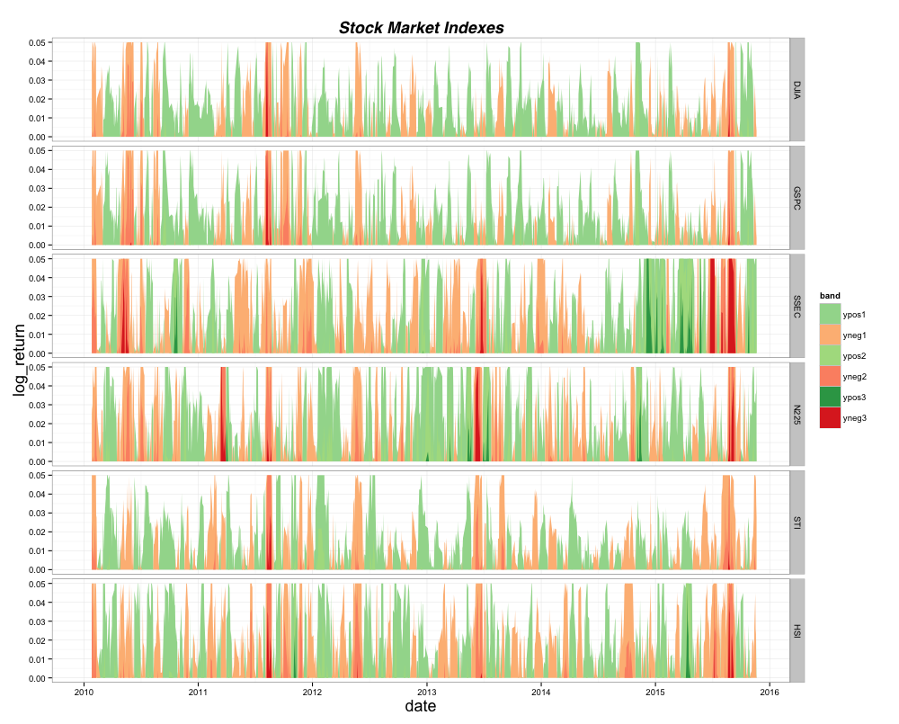

##Homework 8

My plot is a horizon plot. Different levels of neg or pos log_return are calculated by the scale every plot.

For this plot, the scale is 0.05, which means the first level is 0-0.05, the second level is 0.05-0.10 and the third level is 0.10-0.15.

Each facet represents log daily return of one stock market.  

